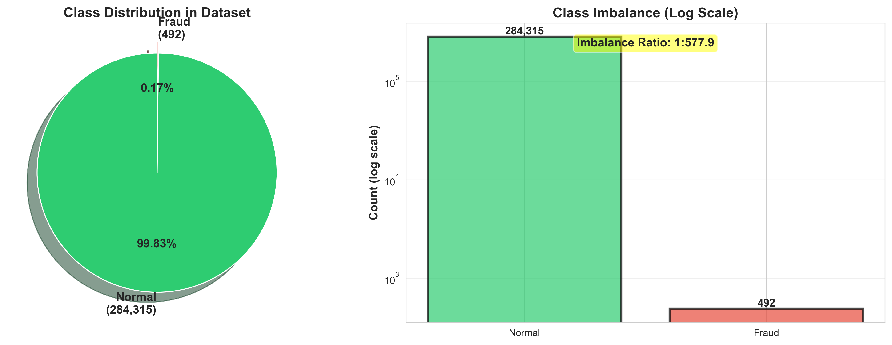
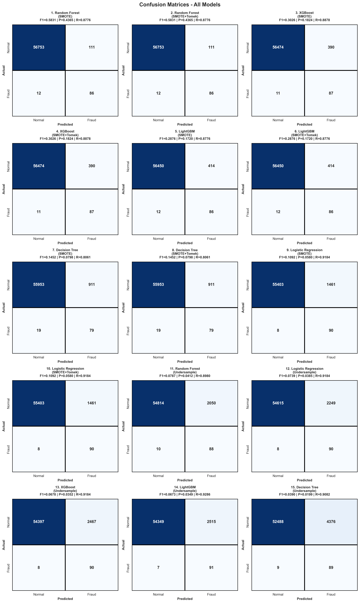
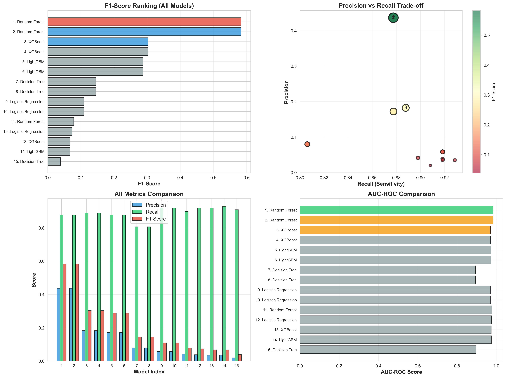
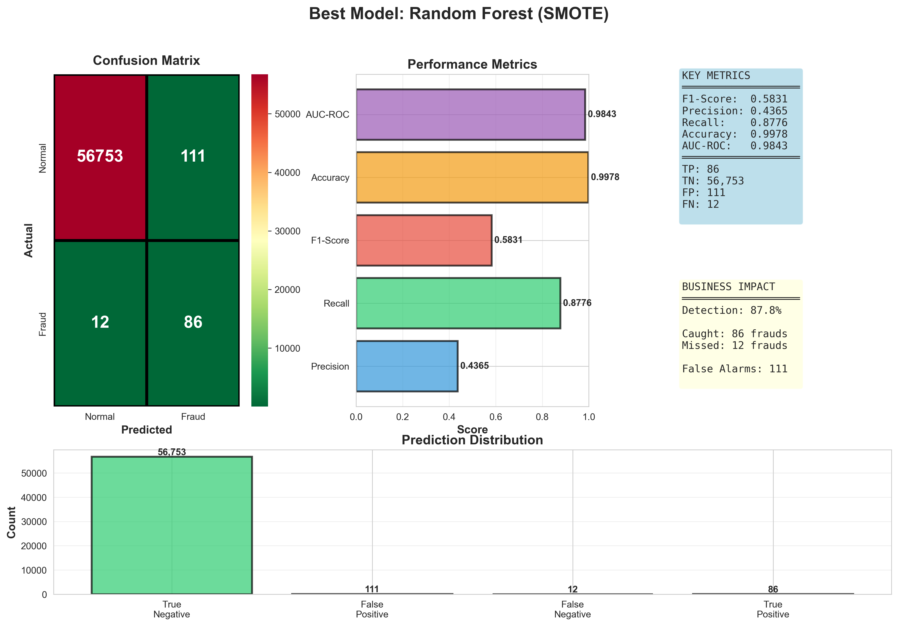
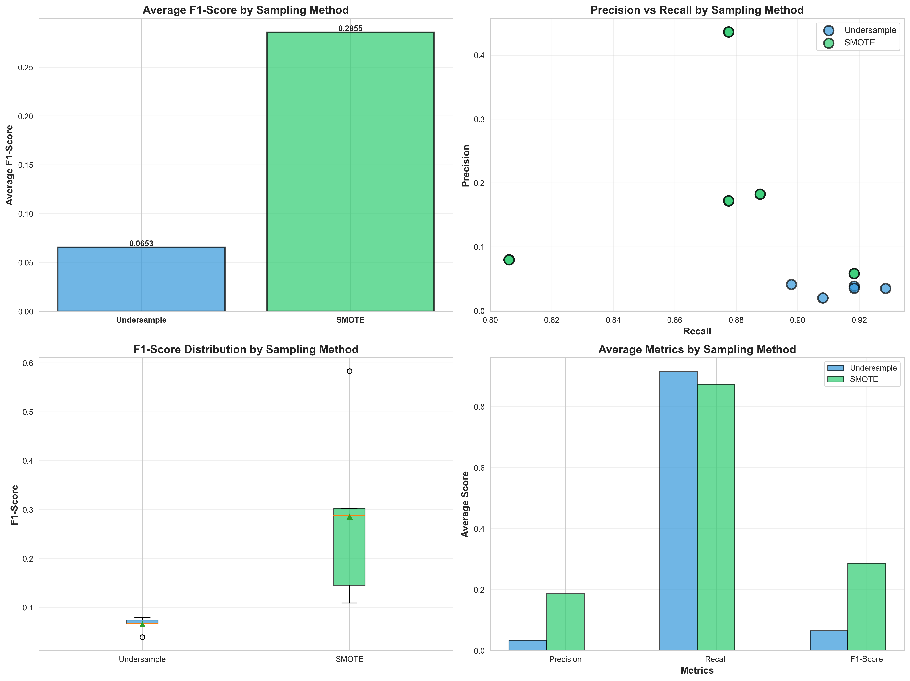

# Credit Card Fraud Detection - Project Report

Generated: 2025-11-05 12:06:37

## Executive Summary

Best Model: **Random Forest (SMOTE)**
- F1-Score: 0.5831
- Precision: 0.4365
- Recall: 0.8776
- AUC-ROC: 0.9843

## Visualizations

### Dataset Overview

### Class Distribution

### All Confusion Matrices

### Metrics Comparison

### Best Model Analysis

### Sampling Strategy Comparison

## Results

| Rank | Model | Precision | Recall | F1-Score |
|:----:|-------|:---------:|:------:|:--------:|
| 1 | Random Forest (SMOTE) | 0.4365 | 0.8776 | 0.5831 |
| 2 | Random Forest (SMOTE+Tomek) | 0.4365 | 0.8776 | 0.5831 |
| 3 | XGBoost (SMOTE) | 0.1824 | 0.8878 | 0.3026 |
| 4 | XGBoost (SMOTE+Tomek) | 0.1824 | 0.8878 | 0.3026 |
| 5 | LightGBM (SMOTE) | 0.1720 | 0.8776 | 0.2876 |
| 6 | LightGBM (SMOTE+Tomek) | 0.1720 | 0.8776 | 0.2876 |
| 7 | Decision Tree (SMOTE) | 0.0798 | 0.8061 | 0.1452 |
| 8 | Decision Tree (SMOTE+Tomek) | 0.0798 | 0.8061 | 0.1452 |
| 9 | Logistic Regression (SMOTE) | 0.0580 | 0.9184 | 0.1092 |
| 10 | Logistic Regression (SMOTE+Tomek) | 0.0580 | 0.9184 | 0.1092 |

## Conclusion

Project completed successfully!
